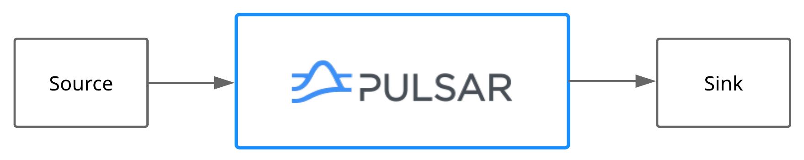

# Legacy-Systeme mit Apache Pulsar verbinden

Messaging-Systeme sind am leistungsfähigsten, wenn sie problemlos mit externen Systemen wie Datenbanken und anderen Messaging-Systemen verwendet werden können. Mit Pulsar IO-Konnektoren können Sie problemlos Konnektoren erstellen, bereitstellen und verwalten, die mit externen Systemen interagieren.


## Was ist Apache Pulsar

### Features
Pulsar ist eine mandantenfähige, leistungsstarke Lösung für Server-zu-Server-Messaging und ist eine nennenswerte Alternative zu Apache Kafka. Einige der Vorteile gegenüber Kafka sind:

  * Transparente Geo-Replikation von Nachrichten über mehrere Cluster hinweg
  * Skalierbarkeit auf über eine Millionen Topics
  * Garantierte Nachrichtenzustellung mit persistenter Nachrichtenspeicherung durch Apache BookKeeper.
  * Tiered Storage verlagert Daten von Hot/Warm Storage auf Cold/Long Term Storage (z. B. AWS S3 und GCS), wenn die Daten altern.
  * Pulsar Functions, ein serverloses, leichtgewichtiges Computing-Framework, dass die Möglichkeit zur stream-nativen Datenverarbeitung bietet.
  * Pulsar IO, ein Connector-Framework, das auf Pulsar Functions aufbaut, erleichtert die Übertragung von Daten in und aus einer Apache Pulsar Instanz.
  
Pulsar basiert auf dem Publish/Subscribe (pub/sub) Pattern, das bedeutet Produzenten erzeugen Nachrichten und veröffentlichen (publish) diese in sogenannten Topics. Konsumenten verarbeiten diese Nachrichten in dem sie sich diese Topics abonnieren (subscribe) und die Nachricht gegenüber dem Broker bestätigen, wenn sie die Nachricht erfolgreich verarbeitet haben. 


### Architektur
Eine Pulsar Instanz besteht aus einem oder mehreren Pulsar Clustern, die ihre Daten untereinander replizieren können.
Innerhalb eines Pulsar Clusters sind folgende Komponenten zu finden: 

  * Ein oder mehrere Broker verarbeiten eingehende Nachrichten von Produzenten und sorgen für einen Lastausgleich, leiten Nachrichten an Konsumenten weiter, kommunizieren mit dem Pulsar-Konfigurationsspeicher, um verschiedene Koordinationsaufgaben zu erledigen, speichern Nachrichten in BookKeeper-Instanzen (auch Bookies genannt), greifen für bestimmte Aufgaben auf einen clusterspezifischen ZooKeeper-Cluster zurück und vieles mehr.
  * Ein BookKeeper-Cluster, der aus einem oder mehreren Bookies besteht, übernimmt die dauerhafte Speicherung von Nachrichten.
  * Ein für diesen Cluster spezifischer ZooKeeper-Cluster übernimmt die Koordinierungsaufgaben zwischen Pulsar-Clustern.


## Pulsar IO

### Einleitung
Wie bereits erwähnt existiert mit Pulsar IO ein Connector-Framework um mit Drittsystemen zu interagieren. Dabei unterscheidet Pulsar IO wie andere Connector-Frameworks auch zwischen Quellen (source) und Senken (sink). Quellen bringen Daten in eine Pulsar Instanz, Senken lesen die Daten aus einer Pulsar Instanz und schreiben sie in das damit verbundene System.




Pulsar IO liefert eine Reihe an Quellen und Senken mit u.a. für Debezium, Kafka, AWS Kinesis, ElasticSearch. Eine vollständige Liste finde sich auf der Homepage von Apache Pulsar[^1].

### Eigene Quelle anschließen

Eine eigene Quelle zu implementieren ist sehr einfach wie das folgende Beispiel zeigt. Hier wird ein Redis Channel abonniert, damit alle Nachrichten die in diesem Channel veröffentlicht werden auch in Pulsar zu finden sind.

Der erste Schritt ist folgendes Interface zu implementieren. Die `open` Methode wird mit der Konfiguration für diese Quelle und der Umgebung, wo der Konnektor läuft aufgerufen. Danach wird durch Pulsar IO regelmäßig die `read` Methode aufgerufen, um neue Nachrichten von der Quelle zu lesen. Falls keine neuen Nachrichten vorhanden sind, soll dieser Aufruf blockieren.

```java
public interface Source<T> extends AutoCloseable {

    void open(final Map<String, Object> config, SourceContext sourceContext) throws Exception;

    Record<T> read() throws Exception;
}
```

Da Quellen oft nach dem Push-Prinzip arbeiten, so wie die Redis Quelle das auch machen wird, gibt es eine `PushSource<T>` die genau diese Funktionalität implementiert. Das vereinfacht die Quelle, die dann nur noch `consume(Record<T> record)` aufrufen muss, wenn eine neue Nachricht in Pulsar veröffentlicht werden soll.


Die eigentliche Implementierung kann dann direkt geschrieben werden. In der `open` Methode wird zunächst die Konfiguration wird über eine Hilfsklasse aus der übergebenen Konfiguration gelesen und validiert. Danach wird der `RedisClient` initialisert und eine neue pub/sub-Connection erzeugt. An dieser wird dann der eigene `RedisListener` registriert, damit auf neue Nachrichten reagiert werden kann. Zuletzt muss noch der konfigurierte Channel abonniert werden.

```java
@Connector(
        name = "redis",
        type = IOType.SOURCE,
        help = "A simple connector to move messages from a Redis pub/sub to a Pulsar topic",
        configClass = RedisSourceConfig.class)
public class RedisSource extends PushSource<String> {

    private static final Logger logger = LoggerFactory.getLogger(RedisSource.class);

    private RedisClient redisClient;
    private StatefulRedisPubSubConnection<String, String> connection;

    @Override
    public void open(Map<String, Object> config, SourceContext sourceContext) throws Exception {

        RedisSourceConfig redisSourceConfig = RedisSourceConfig.load(config);
        redisSourceConfig.validate();

        redisClient = RedisClient.create(RedisURI.Builder.redis(redisSourceConfig.getHost(), redisSourceConfig.getPort()).build());
        logger.info("A new client to {}:{} has been created successfully.",
                redisSourceConfig.getHost(),
                redisSourceConfig.getPort()
        );
        connection = redisClient.connectPubSub();
        connection.addListener(new RedisListener(this));
        final RedisPubSubCommands<String, String> sync = connection.sync();
        sync.subscribe(redisSourceConfig.getChannelName());
        logger.info("A new listener has been attached to channel {}.",
                redisSourceConfig.getChannelName()
        );
    }
    
        @Override
    public void close() throws Exception {
        connection.close();
        redisClient.shutdown();
    }

}
```

Im `RedisListener` muss dann nur noch die `message` Methode implementiert werden, die beim Empfang einer neuen Nachricht durch die Redis Bibliothek aufgerufen wird. Durch die Verwendung einer `PushSource<T>` ist es ausreichend einen neuen `Record` zu erzeugen und die angebotene `consume` Methode aufzurufen. Der Rest erledigt das Framework automatisch. 

```java
    private static class RedisListener implements RedisPubSubListener<String, String> {

        private static final Logger logger = LoggerFactory.getLogger(RedisListener.class);

        private final RedisSource source;

        public RedisListener(RedisSource source) {
            this.source = source;
        }

        @Override
        public void message(final String channel, final String message) {
            logger.info("Recieved message \"{}\" from channel \"{}\".", message, channel);
            RedisRecord record = new RedisRecord(Optional.ofNullable(channel), message);
            this.source.consume(record);
            logger.info("Message consumed.");
        }

        @Override
        public void message(String pattern, String channel, String message) {
            logger.info("Method not implemented.");
        }

        @Override
        public void subscribed(String channel, long count) {
            logger.info("Method not implemented.");
        }

        @Override
        public void psubscribed(String pattern, long count) {
            logger.info("Method not implemented.");
        }

        @Override
        public void unsubscribed(String channel, long count) {
            logger.info("Method not implemented.");
        }

        @Override
        public void punsubscribed(String pattern, long count) {
            logger.info("Method not implemented.");
        }
    }

    private static class RedisRecord implements Record<String> {
        private final Optional<String> key;
        private final String value;

        public RedisRecord(Optional<String> key, String value) {
            this.key = key;
            this.value = value;
        }

        @Override
        public Optional<String> getKey() {
           return key;
        }

        @Override
        public String getValue() {
            return value;
        }
    }

```
Ein vollständiges Beispiel inkl. Anleitung zum Ausprobieren findet sich auf GitHub [^2].


## Fazit

Mit Pulsar IO ist es sehr einfach Daten in eine Pulsar Instanz hinein und hinaus zu bekommen. Die API nimmt einem mit der `PushSource<T>` eine menge Arbeit ab und vereinfacht die Implementierung, so dass der Fokus auf das Drittsystem und nicht auf Pulsar gelegt werden kann.
Damit gibt es eine weitere Alternative im Bereich der verteilten Messaging- und Streaming-Plattformen, um Legacy-Systeme in moderne cloud-native Architekturen zu integrieren.


<!--  LocalWords:  Pulsar Topics Functions IO
 -->

[^1]: Pulsar IO Konnektoren:<https://pulsar.apache.org/docs/en/io-connectors/>
[^2]: Pulsar IO Redis Source <https://github.com/nicolaimainiero/pulsar-io-redis>
